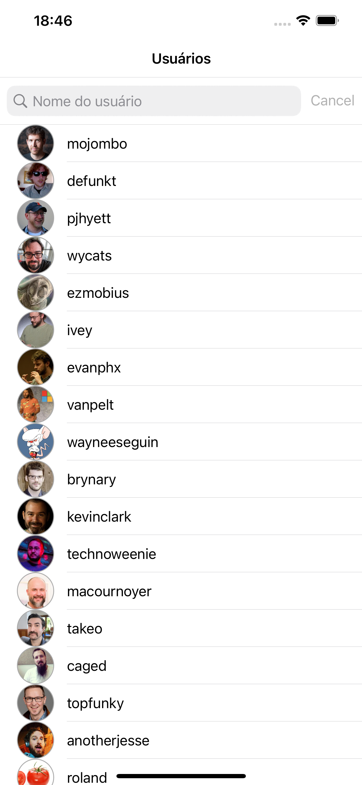
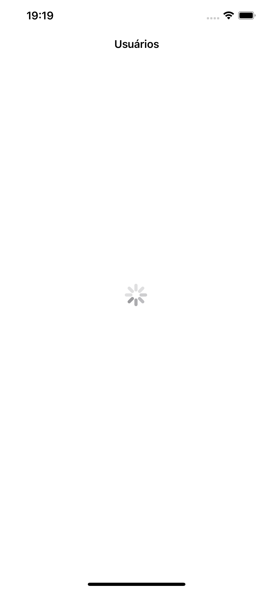
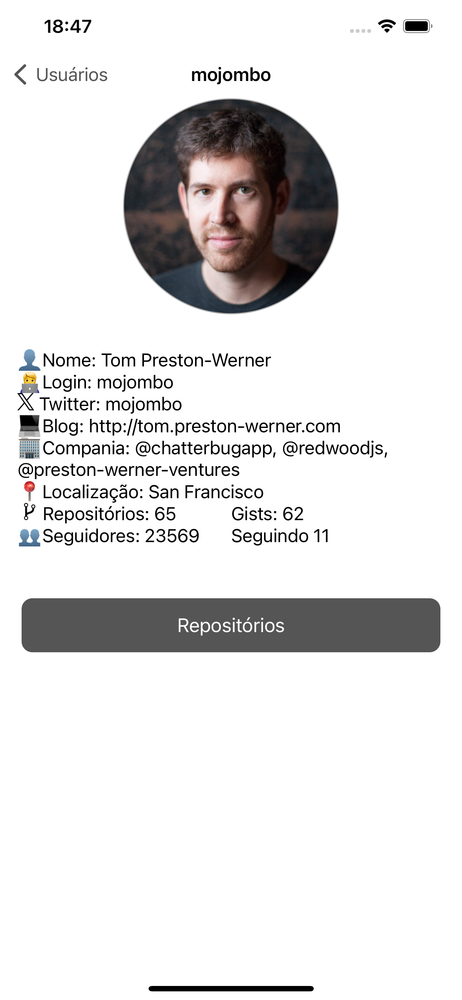
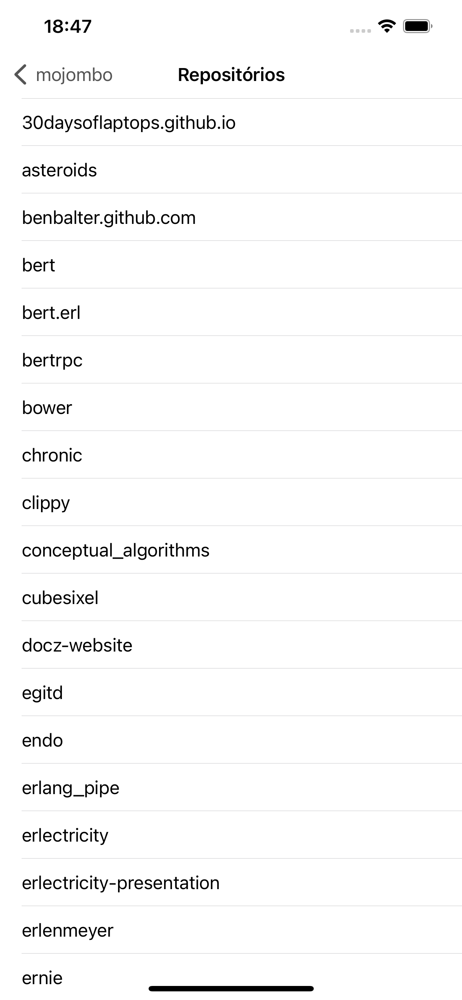
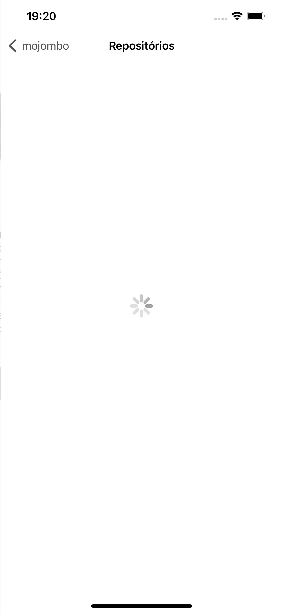
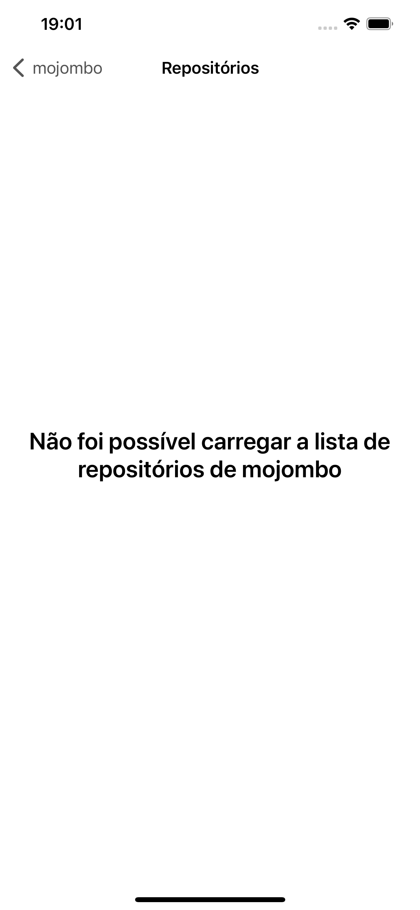

# Desafio_Verity

## Desafio iOS - Verity

O desafio consiste na implementação de uma aplicação iOS que deverá consumir a API pública do Github, que disponibiliza informações sobre os usuários e seus repositórios, onde o aplicativo deverá permitir a listagem de usuários, busca de usuário por nome de usuário e visualização das informações de um usuário específico, bem como a listagem de seus repositórios.

Utilizando a seguinte [API](https://developer.github.com/v3/)

### Primeira Tela - Lista de usuários

Na primeira tela, tem uma lista de usuários do github, tendo a opção de clicar em algum dos itens ou usar o campo de busca para procurar um dos usuários listados. Clicando em um dos usuários, o aplicativo vai para a tela de informações do usuário.  

<kbd>

</kbd>

A tela exibe informações quanto ao carregamento e erro caso haja um problema ao carregar a lista 

<kbd>

</kbd>

### Segunda Tela - Informações de usuário

Na segunda tela são exibidas as informações do usuário selecionado. Clicando no botão "Repositórios", é apresentada a tela com uma lista de repositórios do usuário selecionado 

<kbd>

</kbd>
 

A tela exibe informações quanto ao carregamento e erro caso haja um problema ao carregar as informações do usuário 

<kbd>

</kbd>

### Terceira Tela - Lista de repositórios

<kbd>

</kbd>

A tela exibe informações quanto ao carregamento e erro caso haja um problema ao carregar a lista de repositórios 

<kbd>

</kbd>
